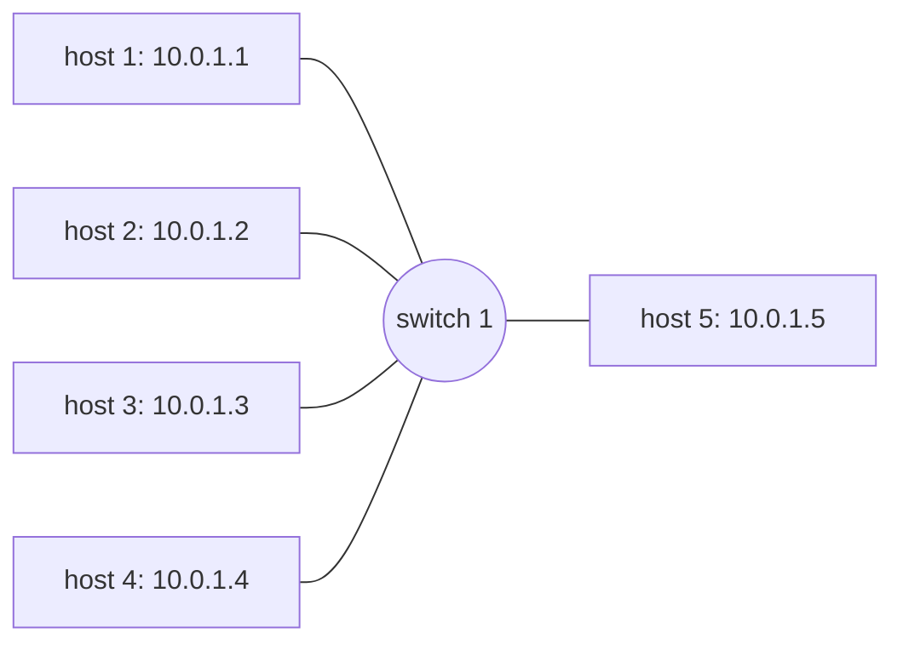
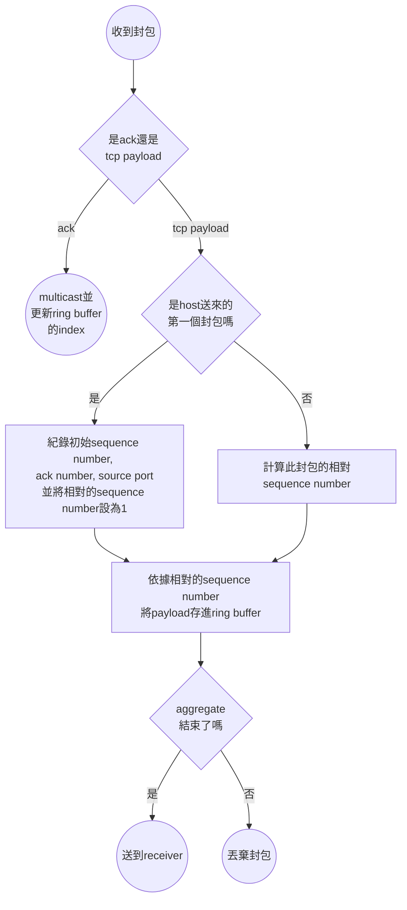
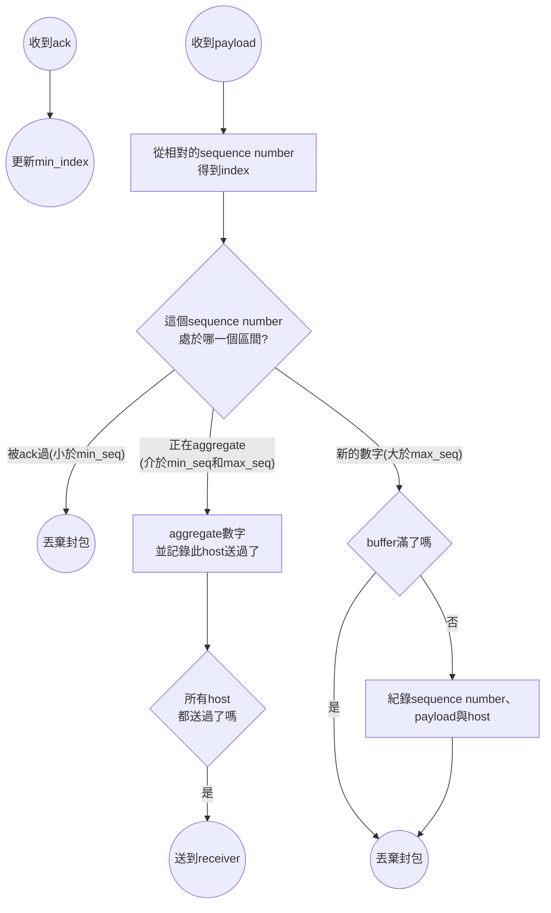

# README

## 1. Introduction

This project is to implement a switch that aggregates numbers from all hosts together. The switch will receive packets each with a number in the payload. The switch will aggregate packets with the same sequence number. After all hosts have sent the packets with the same sequence number, the switch will send the aggregated number to the receiver. The receiver will receive the aggregated number and print it out.

## 2. Design

### 2.1. Topology

The topology is shown in the figure below.



## 3. Implementation

The p4 code can be separated into two parts: the TCP cheater and the ring buffer. The TCP cheater is used to record the sequence number and modify the TCP header. The ring buffer is used to store the payload of the packet.

The TCP cheater has the following flowchart:



The ring buffer has the following flowchart:



## 4. Execute

The project is executed using Makefile. To start the project, run the following command.

```bash
make
```

A mininet console will be created, and you may exit it using `exit` command. 

Use the following command to open the xterm of the hosts.

```bash
xterm h1 h2 h3 h4 h5
```

To run the test, run the following command in each xterm.

```bash
python3 adder.py
```

> Note: It is recommended to run `adder.py` in `h5` after all other hosts have run `adder.py` and are waiting for `h5`.
> This is because `h5` is the receiver, and starting it first will cause several senders to send packets first, which cause the starting time of each sender to be different.

To clean the project, run the following command.

```bash
make clean
```