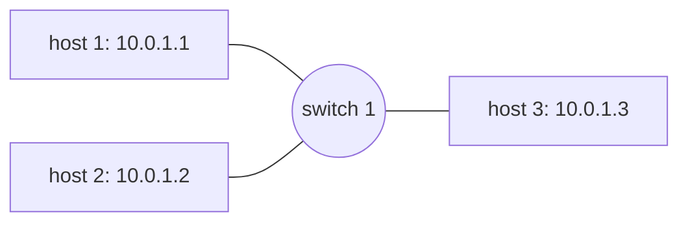

# README

## 1. Introduction

This project is to implement a switch that adds two numbers together. The switch will receive two packets each with an operand. The switch will distinguish the two packets by a sequence number. The switch will add the two operands together and send the result to the third host.

## 2. Design

### 2.1. Topology

The topology is shown in the figure below.



## 3. Implementation

TODO

## 4. Execute

The project is executed using Makefile. To start the project, run the following command.

```bash
make
```

A mininet console will be created, and you may exit it using `exit` command. To clean the project, run the following command.

```bash
make clean
```